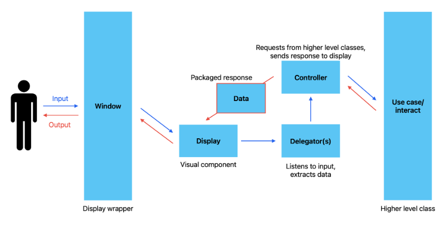

# Crazy Cards

Crazy cards is a single/multiplayer card game adapted from Crazy 8s. Compete against your friends or against our CPU
bots to see who can get rid of their cards the fastest. You can view our rules page and how to play page on more details
on the way our card game is played. Or, you can check your gameplay statistics, and see how many wins or losses you've 
accumulated.

Comments: 
Throughout the code and documentation, we use player and user interchangeably. Once you've entered the gameplay itself, 
feel free to maximize the program window. In the event that the cards you draw are extremely unlucky, this prevents the
cards from becoming hidden behind the action buttons beside your hand. Other screens/windows will be compatible with the
original screen size when the program is run.

## How To Run The Game

Run the file [src/main/Main.java](https://github.com/CSC207-2023Y-UofT/course-project-crazy-cards/blob/main/src/main/java/Main.java).

## GUI & Gameplay

include screenshots of the game and put them in images folder 

## Data Persistence
Players are able to save their progress and resume it. By entering their username, our program locates the player in our database.
If the player is found, the program restores their number of wins and losses; if not, it creates a new player with no wins and losses.
This was done by utilizing [opencsv](https://opencsv.sourceforge.net/), a CSV parser library for Java.

## Clean Architecture, Code Organization, and Style
The code is organized by packages adhering to clean architecture. Packages include entities, use_cases, controllers, database, and UI.

## Design Patterns
Our overall program functionality primarily follows the MVC design pattern. Through user input received by the window and display, 
information is sent to a delegator, which is then sent to a controller, which interacts with use cases and manipulates the entities. 
A response is then received by the controller and the packaged response is processed by visual components to display the new information 
to the user.

### Observer

### Factories

## Design Decisions

use of manager, access..... making a Game accessible only via interfaces

## Testing and Coverage
Under [src/test/java](https://github.com/CSC207-2023Y-UofT/course-project-crazy-cards/tree/main/src/test/java) include comprehensive
tests for the various functionalities of the game. Javadocs are included to further explain each test.

### What we haven't tested

## Extensibility

## Future Updates

## Known Bugs

